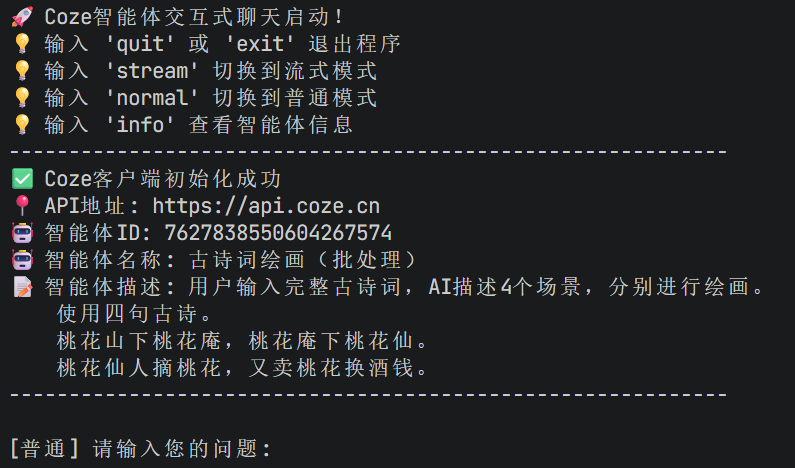
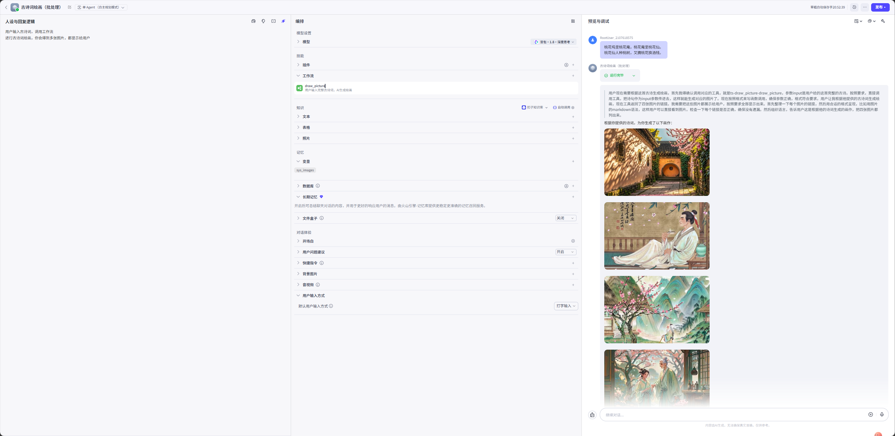
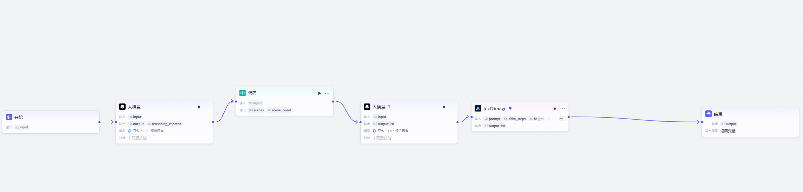

# 古诗词绘画系统（批处理）大模型开发项目 README 指南

## 一、标准结构与内容要点

### 1. 项目简介

- **标题**：批处理+文字生成图片模型
- **定位**：古诗词绘画系统（批处理）是一款结合了中国传统文化与现代人工智能技术的创新应用。该系统旨在通过深度学习和图像生成技术，将古诗词中的意境和意象转化为可视化的绘画作品，为用户提供一种全新的文化体验和艺术享受。
- **状态徽章**：使用Shields.io生成动态徽章，展示项目活跃度与技术栈

  ``\
  ``\
  ``\
  ``
- **快速体验入口**：提供在线Demo链接（如Vercel/Hugging Face Spaces）

### 2. 项目价值

- **问题背景**：在大模型应用中，特别是在处理文化创意类任务时，常面临以下具体挑战：
    ‌批处理效率低下‌：
    当需要处理大量古诗词并生成对应的绘画作品时，传统方法往往效率极低，无法满足大规模生成的需求。
    ‌文字到图片的转换难题‌：
    古诗词蕴含丰富的意境和意象，将其准确转化为视觉图像是一项极具挑战性的任务。传统方法在理解诗词深层含义并将其映射到图像特征上存在显著困难。
    ‌风格定制与一致性保持‌：
    不同的古诗词可能需要不同的绘画风格来表现，同时在批处理过程中保持作品风格的一致性和质量稳定性也是一个难题。
- **解决方案**：古诗词绘画系统通过以下方式有效解决了上述问题：
    ‌高效批处理机制‌：
    系统设计了专门的批处理流程，能够同时处理多首古诗词，自动完成从诗词解析到绘画生成的整个流程，极大提高了生成效率。
    ‌深度文字理解与图像生成‌：
    利用深度学习模型，系统能够深入理解古诗词的语义和情感，并将其转化为具体的图像元素和风格特征，实现高质量的文字到图片的转换。
    ‌灵活风格定制与质量控制‌：
    系统支持用户根据个人喜好选择绘画风格，并在批处理过程中保持风格的一致性和作品质量的稳定性，满足用户的个性化需求。
- **技术亮点**：‌
    优化的批处理算法‌：
    系统采用先进的算法优化批处理流程，确保在处理大量任务时仍能保持高效稳定的运行状态。
    ‌精准的文字-图像映射技术‌：
    通过深度学习和自然语言处理技术，系统实现了对古诗词的精准理解和到图像特征的精确映射，生成符合诗词意境的绘画作品。
    ‌动态风格调整与适配‌：
    系统能够根据用户选择的风格动态调整生成参数，确保每幅作品都能准确呈现用户所期望的艺术风格。
    ‌高质量的图像生成与输出‌：
    采用高分辨率的图像生成技术，系统能够输出清晰、细腻、富有艺术感染力的绘画作品，满足用户的审美需求。

  `✨ **多模型兼容**：支持OpenAI、国产大模型及本地Llama系列模型`\
  `🤝 **批处理机制**：能够同时在多个角度处理古诗词`\
  `🚀 **API服务**：cozen的api接口，支持高并发调用`\
  `📊 **可视化监控**：内置Agent执行流程追踪与性能分析面板`

### 3. 快速开始：让用户5分钟跑通项目

- **环境要求**：cozepy>=0.7.0   python-dotenv>=1.0.0 
- **安装步骤**：pip install -r requirements.txt

  `# 克隆项目`\
  `git clone https://github.com/your-username/your-repo.git`\
  `cd your-repo`\
 
  `# 安装依赖`\
  `pip install -r requirements.txt`\
 
- **运行示例**：提供最简可执行代码，展示核心功能

  运行coze_client.py文件
  
  在终端框中选择stream流式模式
  输入四句古诗词，即可得到四幅古诗绘画图片
  
### 4. 架构设计：展示技术深度

- **系统架构图**：使用cozen官方开发框架，直观展示组件关系

  `graph TD`\
  `    A[用户请求] --> B[大模型从四个角度理解古诗词含义]`\
  `    B --> C[通过代码，从四个不同角度对古诗词进行理解，生成语言]`\
  `    C --> D[针对描述的场景，编写文生图提示词]`\
  `    D --> E[根据文字场景生成图片]`\
  `    E --> F[结果生成器]`\
  `  
- **核心组件说明**：通过大模型生成古诗词场景，使用text2image生成图片
  - **Agent框架**：基于豆包1.8大模型实现角色定义、任务分配与协作逻辑
  - **模型适配层**：统一封装不同大模型的API调用，实现无缝切换
  - **工具系统**：支持动态扩展的工具调用能力，如搜索、代码执行、数据库查询等
  - **记忆机制**：集成向量数据库实现长对话上下文管理

### 5. 附录：补充信息

- **技术栈清单**：列出核心依赖库与版本

  `| 技术栈       | 版本   | 用途                     |`\
  `|--------------|--------|--------------------------|`\
  `| Python       | 3.9+   | 开发语言                 |`\
  `| cozepy       | 0.7.0  | Agent协作框架            |`\
  `| python-dotenv| 1.0.0  | 环境配置服务框架           |`\
 
- **许可证**：明确项目开源许可证（如MIT、Apache 2.0）
- **联系方式**：提供作者邮箱、社交媒体链接或Discord社区入口

## 📞 联系方式

- 作者：Pengcheng Song
- 邮箱：18749036185@126.com
- 项目地址：https://github.com/dfthbvf/dfthbvf/edit/master/Chinese_poetry_painting
