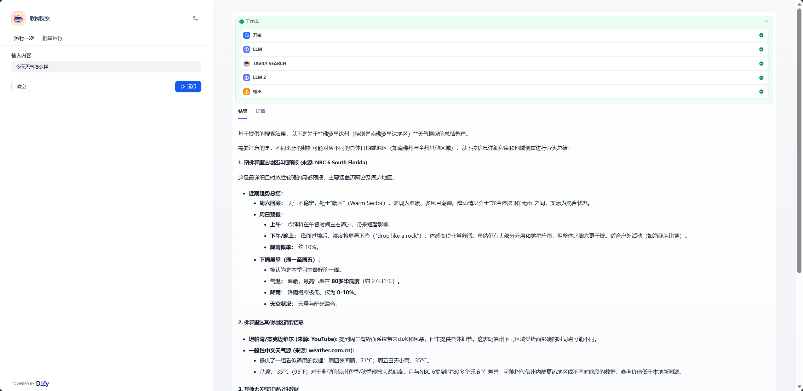
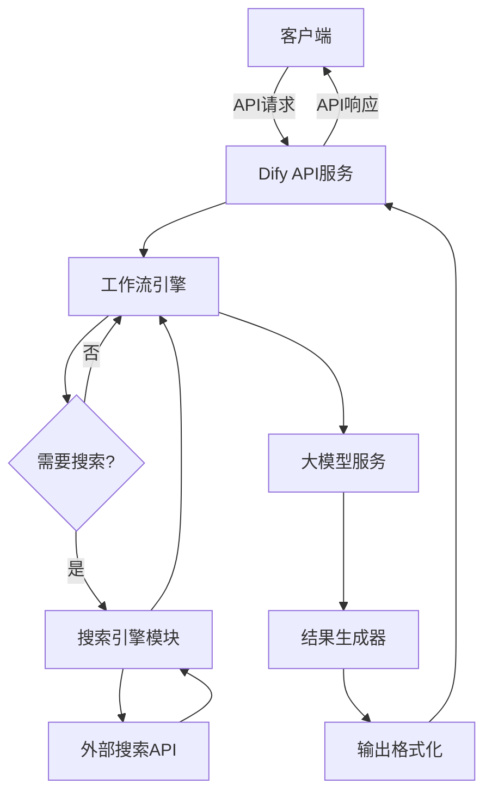
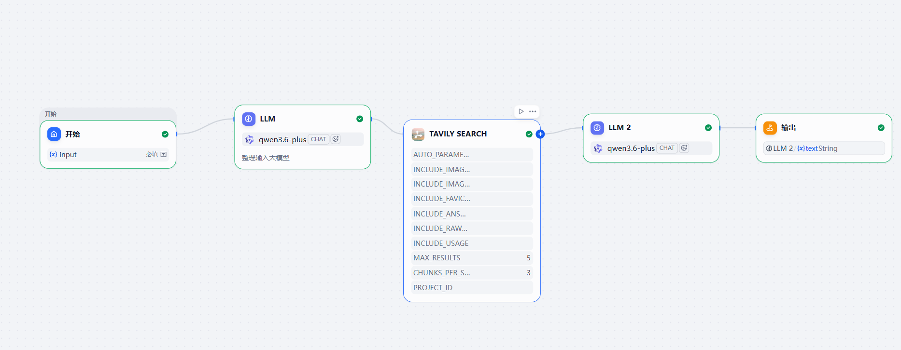

# Dify 大模型联网搜索工作流

基于 Dify API 构建的大模型联网搜索工作流应用，通过 RESTful API 调用实现实时网络搜索与智能问答的无缝集成。

## 🌟 核心特性

- 🔍 **实时联网搜索**：集成搜索引擎，获取最新资讯与数据
- 🤖 **大模型问答**：通过 API 调用实现智能问答能力
- 🚀 **轻量部署**：无需本地部署服务，直接通过 API 访问
- 📊 **结果整合**：将搜索结果与大模型回答智能整合
- 🔧 **灵活配置**：支持自定义 API 地址与密钥配置

## 🚀 快速开始

### 环境要求

- Python 3.9+
- Dify 工作流应用 API Key
- Dify 服务 API 地址（云端或远程服务）

### 安装与运行

```bash
# 克隆项目
git clone <repository-url>
cd dify-workflow-example

# 创建虚拟环境
python -m venv venv
source venv/bin/activate  # Linux/Mac
venv\Scripts\activate     # Windows

# 安装依赖
pip install dify-agent-client

# 配置 API 参数
# 编辑 dify_workflow_example.py，配置 BASE_URL 和 API_KEY

# 运行示例
python dify_workflow_example.py
```

### 核心代码示例

```python
from dify_agent_client import DifyAgentClient

# API 配置
BASE_URL = "http://localhost:8090/v1"
API_KEY = "app-your-api-key"

# 创建客户端
client = DifyAgentClient(BASE_URL, API_KEY)

# 运行工作流
user_input = "今天天气怎么样"
result = client.run_workflow(
    inputs={"input": user_input},
    user_id="demo_user"
)

print(f"工作流回复: {result.get('answer')}")
```
运行界面展示


## 🏗️ 系统架构



### 工作流程

1. **客户端请求**：通过 API 调用发送用户查询
2. **API 路由**：Dify API 服务接收并路由请求
3. **工作流执行**：工作流引擎编排搜索与问答流程
4. **联网搜索**：如需实时信息，调用外部搜索 API
5. **大模型处理**：将搜索结果输入大模型生成回答
6. **结果返回**：格式化结果并返回给客户端

workflow展示


## 📖 使用指南

### API 配置

```python
# 配置 Dify API 地址和密钥
BASE_URL = "http://localhost:8090/v1"  # 替换为实际 API 地址
API_KEY = "app-your-api-key"          # 替换为您的 API Key
```

### 工作流调用

```python
# 创建客户端
client = DifyAgentClient(BASE_URL, API_KEY)

# 基本调用
result = client.run_workflow(
    inputs={"input": "用户问题"},
    user_id="user-123"
)

# 结果处理
if result.get("error"):
    print(f"调用失败: {result.get('message')}")
else:
    print(f"回复: {result.get('answer')}")
    print(f"运行ID: {result.get('workflow_run_id')}")
```

### 支持的 API 端点

- **工作流执行**：`POST /workflows/run`
- **对话流调用**：`POST /chat-messages`

## 📊 技术栈

| 技术栈 | 版本 | 用途 |
|--------|------|------|
| Python | 3.9+ | 开发语言 |
| dify-agent-client | latest | Dify API 客户端 |

## 📄 许可证

本项目采用 MIT 许可证。

## 📞 联系方式
作者：Song Pengcheng
邮箱：18749036185@126.com
项目地址：https://github.com/dfthbvf/dfthbvf/edit/master/LLM_search

如有问题或建议，欢迎提交 Issue 或联系开发者。
