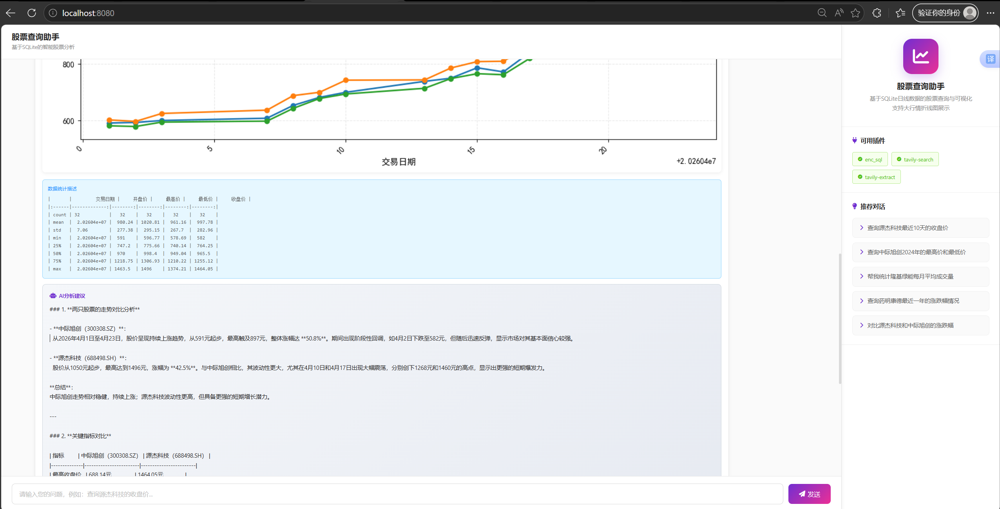

# 股票查询助手ChatBI 大模型开发项目 README 指南

## 一、标准结构与内容要点

### 1. 项目简介

- **标题**：股票查询助手ChatBI - 智能股票数据分析系统
- **定位**：股票查询助手ChatBI是一款基于大语言模型的智能股票数据分析应用。该系统结合了SQL查询、知识库检索和数据可视化技术，为用户提供便捷的股票历史数据查询与分析服务。
- **状态徽章**：

  
  

- **快速体验入口**：运行 `stock_query_assistant.py` 启动Web界面

### 2. 项目价值

- **问题背景**：在股票数据分析中，用户常面临以下挑战：
  
  ‌**数据查询复杂度高**：
  传统股票数据分析需要编写复杂的SQL语句，对非专业用户门槛较高。
  
  ‌**多股票对比困难**：
  对比分析多支股票数据时，需要手动整理和计算，效率低下。
  
  ‌**可视化需求**：
  用户需要直观的图表展示股票走势，但缺乏便捷的工具支持。

- **解决方案**：股票查询助手ChatBI通过以下方式有效解决了上述问题：

  ‌**自然语言查询**：
  用户只需用自然语言描述查询需求，系统自动生成SQL语句并执行查询。
  
  ‌**智能对比分析**：
  支持多支股票的对比查询，自动生成对比图表。
  
  ‌**自动可视化**：
  查询结果自动生成专业的图表，直观展示数据趋势。

- **技术亮点**：

  ✨ **大语言模型驱动**：基于Qwen大模型实现自然语言到SQL的转换
  📊 **智能数据可视化**：自动生成专业的股票走势图
  📚 **知识库增强**：集成FAQ知识库提供准确的查询指导
  🌐 **Web界面交互**：提供友好的网页交互界面
  🔄 **多股票对比**：支持多支股票数据的对比分析

### 3. 快速开始：让用户5分钟跑通项目

- **环境要求**：Python 3.9+

- **安装步骤**：

  ```bash
  # 克隆项目
  git clone https://github.com/your-username/stock-query-chatbi.git
  cd stock-query-chatbi
  
  # 安装依赖
  pip install qwen-agent qwen-agent[rag,gui] dashscope pandas sqlalchemy matplotlib
  ```

- **配置API Key**：
  在 `stock_query_assistant.py` 中配置DashScope API Key：
  ```python
  dashscope.api_key = 'your-api-key'
  ```

- **运行示例**：

  运行主程序：
  ```bash
  python stock_query_assistant.py
  ```
  
  打开浏览器访问：http://localhost:8080
  
  在输入框中输入查询问题，例如：
  - "查询源杰科技最近10天的收盘价"
  - "对比源杰科技和中际旭创的涨跌幅"
  运行界面展示
  
### 4. 架构设计：展示技术深度

- **系统架构图**：

  ```
  graph TD
      A[用户请求] --> B[自然语言理解]
      B --> C[SQL生成]
      C --> D[数据库查询]
      D --> E[数据可视化]
      E --> F[结果展示]
      G[知识库] --> B
  ```

- **核心组件说明**：

  | 组件 | 功能描述 |
  |------|----------|
  | **Agent框架** | 基于qwen-agent实现对话管理和工具调用 |
  | **SQL生成器** | 将自然语言转换为SQL查询语句 |
  | **知识库模块** | 提供FAQ检索和上下文补充 |
  | **数据可视化引擎** | 自动生成股票走势图 |
  | **Web界面** | 提供用户交互界面 |

### 5. 附录：补充信息

- **技术栈清单**：

  | 技术栈 | 用途 |
  |--------|------|
  | Python | 开发语言 |
  | qwen-agent | Agent框架 |
  | DashScope | 大模型API |
  | SQLite | 数据库存储 |
  | Pandas | 数据处理 |
  | Matplotlib | 图表可视化 |
  | Flask | Web服务 |

- **支持的股票**：

  | 股票名称 | 股票代码 |
  |----------|----------|
  | 源杰科技 | 688498.SH |
  | 中际旭创 | 300308.SZ |
  | 隆基绿能 | 601012.SH |
  | 药明康德 | 603259.SH |

- **数据时间范围**：2022-01-01 至 2026-04-23

- **许可证**：MIT License

## 📞 联系方式

- 作者：Your Name
- 邮箱：your-email@example.com
- 项目地址：https://github.com/your-username/stock-query-chatbi